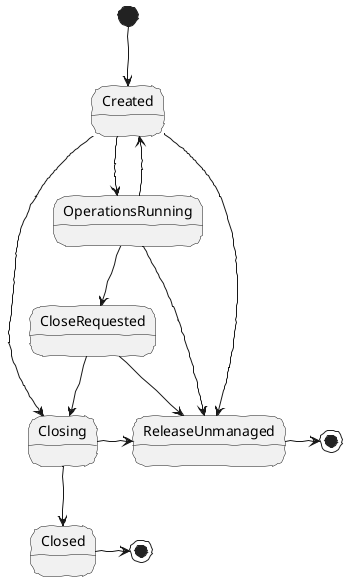

## UnitOfWorkBase state machine diagram

```plantuml
@startuml
    skinparam monochrome true
    skinparam handwritten true
    state Success <<end>>
    state Fault <<end>>
    [*] --> Created
    Created --> OperationsRunning
    OperationsRunning --> Created
    OperationsRunning --> CloseRequested
    Created --> Closing
    Closing --> Closed
    CloseRequested --> Closing
    Created -> ReleaseUnmanaged
    OperationsRunning -> ReleaseUnmanaged
    CloseRequested -> ReleaseUnmanaged
    Closing -> ReleaseUnmanaged
    Closed -> Success
    ReleaseUnmanaged -> Fault

@enduml
```