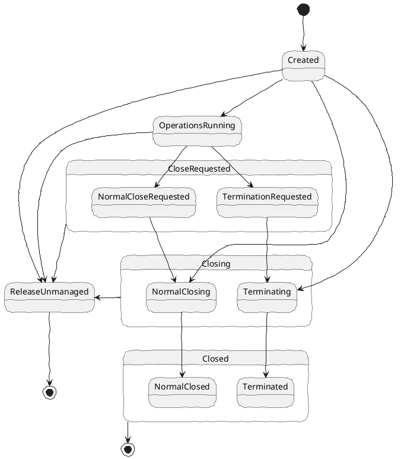

## UnitOfWorkBase state machine diagram

```plantuml
@startuml
    skinparam monochrome true
    skinparam handwritten true
    state Success <<end>>
    state Fault <<end>>
    state CloseRequested {
        state NormalCloseRequested
        state TerminationRequested
    }
    state Closed {
        state NormalClosed
        state Terminated
    }
    state Closing{
        state NormalClosing
        state Terminating
    }

    [*] --> Created
    Created --> OperationsRunning
    Created --> NormalClosing
    Created --> Terminating
    Created -> ReleaseUnmanaged
    OperationsRunning -> ReleaseUnmanaged
    CloseRequested -> ReleaseUnmanaged
    Closing ->ReleaseUnmanaged
    Closed --> Success
    ReleaseUnmanaged --> Fault
    OperationsRunning --> NormalCloseRequested
    OperationsRunning --> TerminationRequested
    NormalClosing --> NormalClosed
    Terminating --> Terminated
    NormalCloseRequested --> NormalClosing
    TerminationRequested --> Terminating
@enduml
```